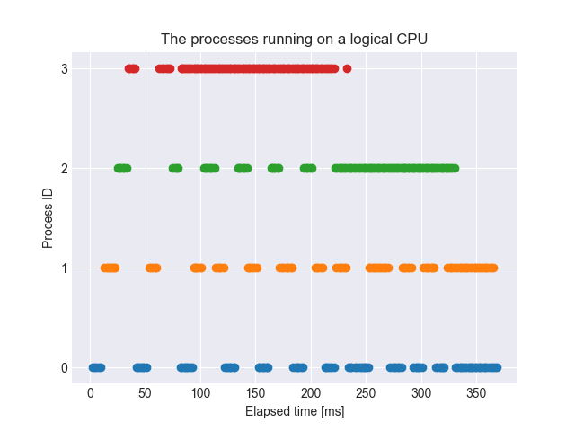
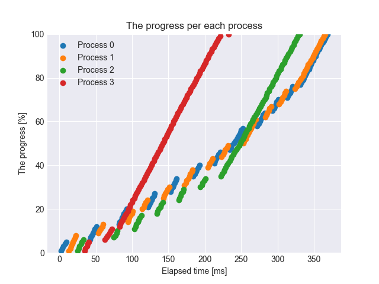

# Chapter 4

Linux kernel provides "process scheduler" to run multi processes at the same time.  
In actual, all processes don't run at the same time because a CPU can process a process.  
When a number of processes are able to run, the scheduler manages to let a CPU run which process.

Let's look this behavior in some experiments.
```bash
root@84ecd6f3285c:/home/scripts/chapter4% cc -o sched sched.c
# To avoid using Load Balancer, let CPU 0 run the sched.c by taskset.
root@84ecd6f3285c:/home/scripts/chapter4% taskset -c 0 ./sched 1 100 1
estimating workload which takes just one milisecond
end estimation
0	2	1
0	4	2
0	6	3
0	8	4
0	9	5
0	11	6
0	13	7
0	14	8
0	16	9
0	17	10
0	19	11
0	20	12
0	22	13
0	23	14
0	25	15
0	26	16
0	28	17
0	29	18
0	30	19
0	32	20
0	33	21
0	35	22
0	36	23
0	38	24
0	39	25
0	41	26
0	43	27
0	44	28
0	46	29
0	47	30
0	49	31
0	50	32
0	52	33
0	54	34
0	56	35
0	57	36
0	59	37
0	60	38
0	62	39
0	64	40
0	65	41
0	67	42
0	69	43
0	70	44
0	72	45
0	74	46
0	76	47
0	77	48
0	79	49
0	80	50
0	82	51
0	84	52
0	85	53
0	87	54
0	89	55
0	91	56
0	92	57
0	94	58
0	96	59
0	97	60
0	99	61
0	101	62
0	102	63
0	104	64
0	105	65
0	107	66
0	109	67
0	110	68
0	112	69
0	114	70
0	115	71
0	117	72
0	119	73
0	120	74
0	122	75
0	124	76
0	125	77
0	127	78
0	129	79
0	130	80
0	132	81
0	133	82
0	135	83
0	136	84
0	137	85
0	139	86
0	141	87
0	142	88
0	144	89
0	145	90
0	147	91
0	148	92
0	150	93
0	152	94
0	153	95
0	155	96
0	157	97
0	159	98
0	160	99
0	162	100
```
The below figures show CPU 0 always run Process 0 and the progress increases according to elapsed time.  


What happen running 2 processes on a CPU?
```bash
root@84ecd6f3285c:/home/scripts/chapter4% taskset -c 0 ./sched 2 100 1
estimating workload which takes just one milisecond
end estimation
```
The first figure shows processes use alternately a logical CPU and both processes have roughly same timeslices.  
  
The second figure shows a process progresses only when using a logical CPU and another process doesn't progress.  
Comparing with the progress of 1core-1process, progress per time is half and elapsed time to complete a task is twice as long.  


Last, how about running 4 processes on a CPU?
```bash
root@84ecd6f3285c:/home/scripts/chapter4% taskset -c 0 ./sched 4 100 1
estimating workload which takes just one milisecond
end estimation
```
Both figures show same trends when running 2 processes on a CPU.  


This trend switching processes on a logical CPU is called "context switch".  
Let's assume the following code.
```c
void main(void) {
    foo()
    bar()
}
```
By context switch, `bar()` after `foo()` doesn't always run after `foo()` immediately.  
The following figure drawn from [Linux Kernel Process Management](http://www.informit.com/articles/article.aspx?p=370047) describes the state of process.  

It shows a process switches its state over and over again.

Next, we consider the throughput AND the latency and difine the throughput as `the number of completed processes / elapsed time` and the latency as `end time - start time`.  
Using the result of running a task with some processes on a CPU, the throghput and the latency are as below.

| # of processes | throughput (# of processes / sec) | latency (ms) |
|:---------------|:----------------------------------|:-------------|
|1|6.172|162|
|2|5.865|341|
|4|5.961|671|

From the above table, we find the following things.
- When all logical CPUs don't idle, the throughput doesn't improve by increasing the number of processes.
- The more the number of processes increase, the worth the latency is.
- The latencies for each process are equal.

Next, let's look a scheduler when multi logical CPUs.
```bash
root@84ecd6f3285c:/home/scripts/chapter4% taskset -c 0,2 ./sched 1 100 1
root@84ecd6f3285c:/home/scripts/chapter4% taskset -c 0,2 ./sched 2 100 1
root@84ecd6f3285c:/home/scripts/chapter4% taskset -c 0,2 ./sched 4 100 1
```
When running only one process, the result is same as it on a logical CPU.  


Comparing to the result of 2 processes on a CPU, the processes run at almost same time and the elapsed time are improved.  
But the throughput and the latency don't improve twice as much.  


The result of 4 processes on 2 logical CPUs also improve in the same way of 2 processes on 2 logical CPUs.  



Using the above results, the throghput and the latency are as below.

| # of processes | throughput (# of processes / sec) | latency (ms) |
|:---------------|:----------------------------------|:-------------|
|1|6.06|165|
|2|9.523|210|
|4|10.84|369|

From these experiments, we find following things.
- A CPU run a process.
- When a number of processes are able to run, the scheduler manages to let a CPU run which process.
- On multicore CPU environment, we gain improvements only when running multi processes and usually improvement rate isn't proportional to the number of cores.
- We cannot improve the throughput by increasing the number of processes more than that of cores.

On above situations every processes use CPUs fairly, but we can control the priority of processes.  
The `nice()` system call is used to set a priority of a process.  
Let's confirm the effect of `nice()`.
```bash
root@84ecd6f3285c:/home/scripts/chapter4% cc -o sched_nice sched_nice.c
root@84ecd6f3285c:/home/scripts/chapter4% taskset -c 0 ./sched_nice 100 1
```
The following figures show Process 0 is taken precedence over Process 1.  
This is because Process 0 has a higher priority than Process 1.  


## References
- [［試して理解］Linuxのしくみ～実験と図解で学ぶOSとハードウェアの基礎知識](https://gihyo.jp/book/2018/978-4-7741-9607-7)
- [Linux Kernel Process Management](http://www.informit.com/articles/article.aspx?p=370047)