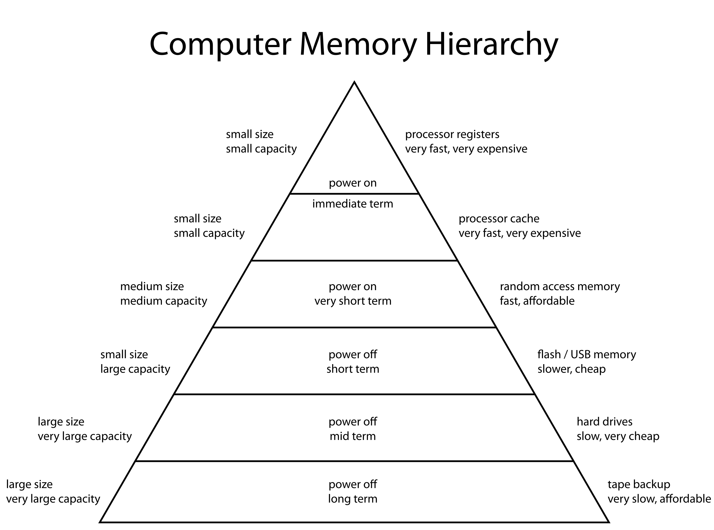
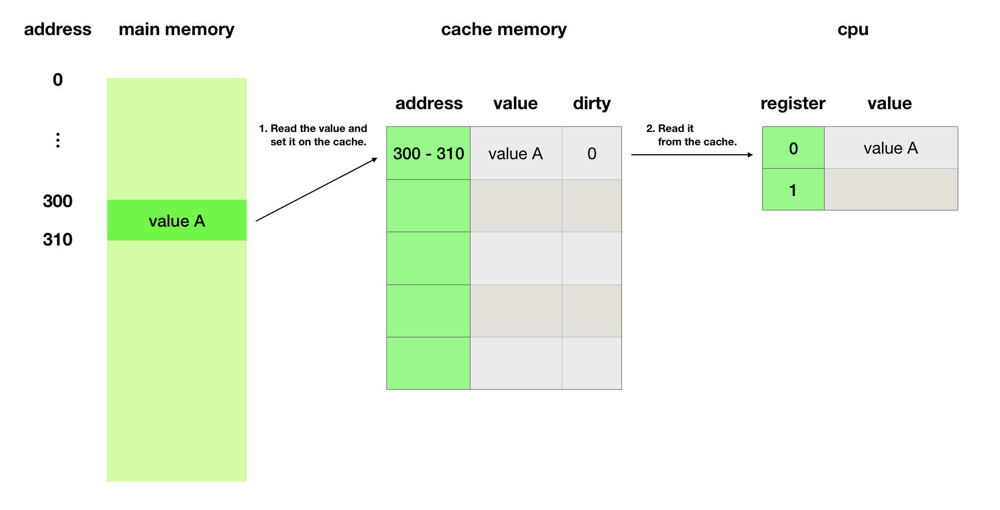
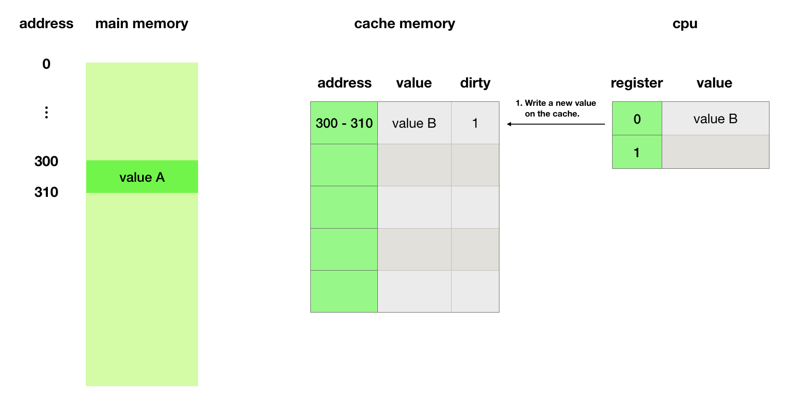
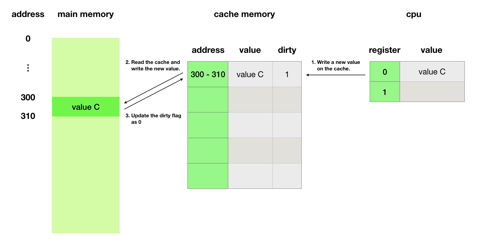
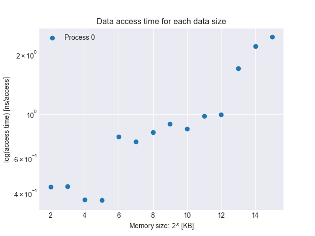

# Chapter 6

The following figure quoted from [Wikipedia](https://en.wikipedia.org/wiki/Memory_hierarchy) shows storage devices features.  


The processing flow on computers is as follows.
- According to instructions, read the data from memory to a register.
- Calculate a value based on the data on registers.
- Write a result on memory.

Compared to calculation time, memory access time is extremely slow.  
Cache memory exists between main memory and cpu and improves this bottleneck.  
When read a value from memory to a register, computers read it on _cache memory_ at first, then read the value to the register.  
The reading size is _cache line size_ defined for each CPU.  

The following figures show how to work _cache memory_.  
We assume here _cache line size_ is 10 bytes, the size of _cache memory_ is 50 bytes and registe 0 and register 1 have 10 bytes.  

Now register 0 reads data at address 300.  
When cpu read tha data again, computers don't need to access memory because _cache memory_ has the data.


After calculation, register 0's value is replaced and cpu overwrites the cache.   
Then the new value is different with the original, so cpu marks it as _dirty_.  
At that time, Computers don't overwrite main memory immediately.  
Overwriting main memory is processed as background work.  



When _cache memory_ is full and reading data not on it, computers remove the cache and copy the new data on _cache memory_.  
If the removed cache is dirty, computers overwrite main memory.  
When all caches are dirty, computers swap caches frequently and it drops performances.  
It is called _thrashing_.

Modern cpu have hierarchical cache memory.  
Each cache memory is named like _L1 (Level 1)_, _L2 (Level 2)_.  
_Level 1_ is the fastest and has the smallest capacity.

To understand _cache memory_ more deeply, let's confirm how the data access time for each data size changes.  
`cache.c` do the following.
- acquiring the memory specified by the argument
- accessing the memory sequential
- display time (ns) per access

My cpu is [i5-6500](https://en.wikichip.org/wiki/intel/core_i5/i5-6500) and
_cache line size_ is the following.  
So I set `CACHE_LINE_SIZE` in `cache.c` as 32.

| Level | Cache line size |
|:-----:|:---------------:|
| L1 | 32KB |
| L2 | 1MB |
| L3 | 6MB |

```bash
root@a1d23e85d9cd:/home/scripts/chapter6% cc -O3 -o cache cache.c
root@a1d23e85d9cd:/home/scripts/chapter6% for i in 4 8 16 32 64 128 256 512 1024 2048 4096 8192 16384 32768; do ./cache $i; done
0.429685
0.431283
0.370791
0.369551
0.769660
0.727701
0.807912
0.893492
0.840585
0.977626
0.993624
1.698257
2.198635
2.446285
```
The following figure shows the time increases rapidly at the boundary of each cache size.  


To access data at virtual addresses, processes have to do the following.
1. Getting a physical address by page tables.
2. Accessing the physical address.

_Cache memory_ accelerate step 2, hence step 1 is slow.  
CPU have a virtual address to physical address map on _Translation Lookaside Buffer (TLB)_ region and it accelerates step 1.

Storage access time is extremely slower than memory access time.  
_Kernel_ have _page cache_ and it solve the above issue.  
When a process access data on a file, _kernel_ copy it on _page cache_ on itself and on the process's memory.  
If other processes read it, _kernel_ returns it on _page cache_.  
It is fast because the process doesn't need to access storages.
When the process overwrite it, _kernel_ overwrites on _page cache_ and marks it as _dirty page_.  
_Kernel_ write back _dirty pages_ at some time as same as _cache memory_.  
When memory runs out, _kernel_ tries to release not dirty caches.  
If it is still not enough, _kernel_ writes back _dirty pages_.  

Let's show the impact of _page cache_.  
We measure the read time and memory usage.
```bash
root@a1d23e85d9cd:/home/scripts/chapter6% dd if=/dev/zero of=testfile oflag=direct bs=1M count=1K
1024+0 records in
1024+0 records out
1073741824 bytes (1.1 GB, 1.0 GiB) copied, 4.13617 s, 260 MB/s
root@a1d23e85d9cd:/home/scripts/chapter6% free
              total        used        free      shared  buff/cache   available
Mem:        2046748      257984      120112         668     1668652     1629140
Swap:       1048572          80     1048492
root@a1d23e85d9cd:/home/scripts/chapter6% time cat testfile > /dev/null

real	0m4.383s
user	0m0.050s
sys	0m1.010s
root@a1d23e85d9cd:/home/scripts/chapter6% free
              total        used        free      shared  buff/cache   available
Mem:        2046748      249220       77936         648     1719592     1643012
Swap:       1048572        8540     1040032
```
At first time, reading takes 4.182 seconds and _kernel_ uses cpu for 1.01 seconds.  
Therefore the process waits reading storages about 3 seconds.  
Also `free` field decreases from 120112 to 68400 and `buff/cache` field increases from 1668652 to 1719592.  

Second reading takes 0.151 seconds because the process doesn't access storages but copy the data on _page cache_.  
`free` value doesn't change because _kernel_ already has the cache.
```bash
root@a1d23e85d9cd:/home/scripts/chapter6% time cat testfile > /dev/null

real	0m0.151s
user	0m0.000s
sys	0m0.140s
root@a1d23e85d9cd:/home/scripts/chapter6% free
              total        used        free      shared  buff/cache   available
Mem:        2046748      244244       68400         648     1734104     1651272
Swap:       1048572       13700     1034872
```

## References
- [［試して理解］Linuxのしくみ～実験と図解で学ぶOSとハードウェアの基礎知識](https://gihyo.jp/book/2018/978-4-7741-9607-7)